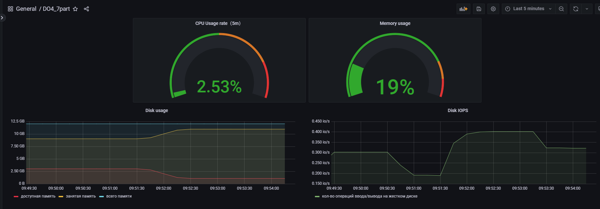
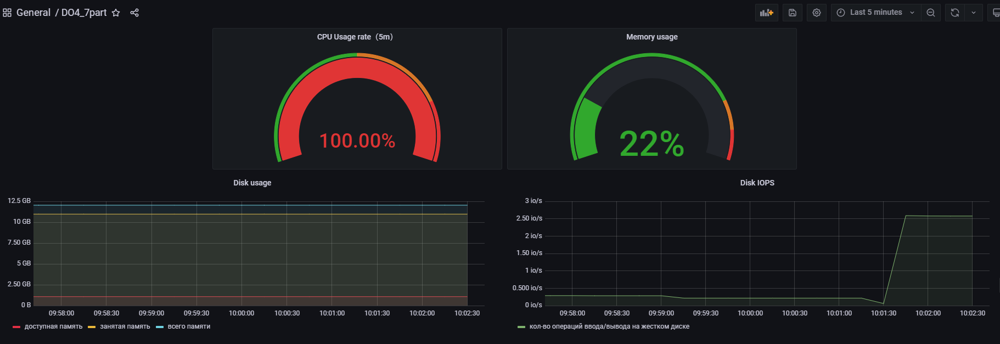

# Simple Docker

```
888                           d8888          888               888    888                        
888                          d88888          888               888    888                        
888                         d88P888          888               888    888                        
88888b.  888  888          d88P 888 .d8888b  88888b.   8888b.  888888 88888b.   .d88b.   .d88b.  
888 "88b 888  888         d88P  888 88K      888 "88b     "88b 888    888 "88b d8P  Y8b d88""88b 
888  888 888  888        d88P   888 "Y8888b. 888  888 .d888888 888    888  888 88888888 888  888 
888 d88P Y88b 888       d8888888888      X88 888  888 888  888 Y88b.  888  888 Y8b.     Y88..88P 
88888P"   "Y88888      d88P     888  88888P' 888  888 "Y888888  "Y888 888  888  "Y8888   "Y88P"  
              888                                                                                
         Y8b d88P                                                                                
          "Y88P"                                                                                 
```


## Установить и настроить Prometheus и Grafana на виртуальную машину

Устанавливаем `Prometheus` 
```
sudo apt install prometheus 
```

запускаем его 

```
sudo systemctl start prometheus
```

Устанавливаем `Grafana`

``` 
sudo apt-get install -y adduser libfontconfig1 musl
wget https://dl.grafana.com/oss/release/grafana_9.2.4_amd64.deb && sudo dpkg -i grafana_9.2.4_amd64.deb
```

и запускаем ее
```
sudo systemctl enable grafana-server && sudo systemctl start grafana-server
```

## Получить доступ к веб интерфейсам **Prometheus** и **Grafana** с локальной машины

* Чтобы перейти в панель `Grafana` используем браузер перейдем по адресу нашего сервера с установленной Graphana и порт (обычно 3000)
`http://172.20.10.8:3000`
* При первом запуске вводим логин: `admin` и пароль: `admin`. После этого будет предложено заменить пароль<br/>
* После этого перейдем `Configuration->Data Source` и нажимаем кнопку `Add Data Source`<br/>
* В открывшемся окне выбираем тип Data Source - `Prometheus`<br/>
* В поле URL вводим адрес сервера, на котором доступен `Prometheus` и его порт. Так как `Grafana` находится на той же машине, что и `Prometheus` (порт по умолчанию 9090), используем `http://172.20.10.8:9090` <br/>
* Сохраняем изменения `Save and Test`<br/>

## Добавить на дашборд **Grafana** отображение ЦПУ, доступной оперативной памяти, свободное место и кол-во операций ввода/вывода на жестком диске. Запустить ваш bash-скрипт из [Части 2]. Посмотреть на нагрузку жесткого диска (место на диске и операции чтения/записи)

Для создание dashboard нажимаем `Add panel->Add new panel`<br/>

Создаем по очереди панели для отображения:
1. `CPU`<br/>
2. `доступной оперативной памяти`<br/>
3. `всей памяти`, `занятой памяти` и `свободной памяти`<br/>
4. `количества операций ввода/вывода на жестком диске`<br/>

Запустим bash-скрипт из `Part 2` и смотрим на нагрузку жесткого диска


## Установить утилиту **stress** и запустить команду `stress -c 2 -i 1 -m 1 --vm-bytes 32M -t 10s` Посмотреть на нагрузку жесткого диска, оперативной памяти и ЦПУ
Установим утилиту `stress`
    ```
     sudo apt install stress
    ```
* Запустим команду
    ```
     stress -c 2 -i 1 -m 1 --vm-bytes 32M -t 60s
    ```
* Проверим результаты работы
    <br/>